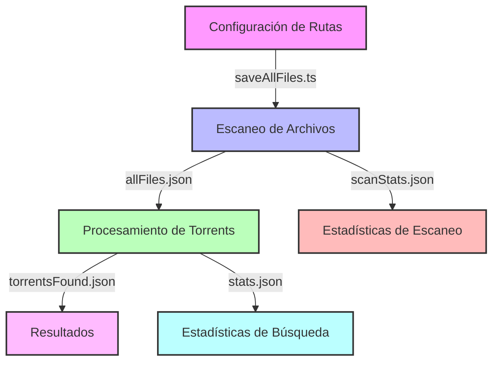

# 🔍 Find Torrents

> 🎯 Herramienta para buscar y localizar archivos de torrents en múltiples ubicaciones.

## ⚡️ Características

- 🚀 Búsqueda rápida en múltiples ubicaciones
- 📊 Estadísticas detalladas de búsqueda
- 🔄 Procesamiento en paralelo
- 📝 Logs detallados del proceso
- 🎯 Alta precisión en coincidencias


## 🔄 Proceso de Recuperación de Torrents

### 1️⃣ Configuración de Rutas 🛠️

Modifica el archivo `src/utils/saveAllFiles.ts` y actualiza el array `SERVERS` con las rutas donde deseas buscar:

```typescript
const SERVERS = [
    "/ruta/a/tu/carpeta1",
    "/ruta/a/tu/carpeta2",
    // Agrega más rutas según necesites
];
```

### 2️⃣ Escaneo de Archivos 🔍

Ejecuta el script para escanear todos los archivos disponibles:

```bash
bun run src/utils/saveAllFiles.ts
```

📄 Este script generará:
- `allFiles.json`: Lista completa de archivos encontrados
- `scanStats.json`: Estadísticas del escaneo

### 3️⃣ Procesamiento de Torrents 🔄

Coloca tus archivos .torrent en la carpeta `torrents/` y ejecuta:

```bash
bun run src/index.ts
```

### 4️⃣ Resultados 📊

Los resultados se guardarán en:
- 📁 `torrentsFound.json`: Ubicación de los archivos de cada torrent
- 📊 `stats.json`: Estadísticas de la búsqueda

## 📥 Importación a qBittorrent (Opcional)

Si deseas importar automáticamente los torrents encontrados a qBittorrent, puedes utilizar el script `src/scripts/importToClient.ts`:

### 1️⃣ **Configuración de Credenciales** 🔑

Modifica las siguientes líneas en `src/scripts/importToClient.ts`:

```typescript
const client = new qBittorrentClient(
	// URL de tu servidor qBittorrent
	"http://tu-servidor:puerto",
	// Tu usuario
	"usuario",
	// Tu contraseña
	"contraseña"
);
```

### 2️⃣ **Configuración de Rutas** 📂

Si es necesario, ajusta el objeto `replaces` para mapear las rutas de origen a las rutas de destino en tu servidor:

```typescript
const replaces = {
	// Añade más mapeos según necesites
	// "/dropbox/": "/downloads/",
};
```

### 3️⃣ **Ejecutar la Importación** 🚀

```bash
bun run src/scripts/importToClient.ts
```

El script:
- ✅ Verifica duplicados antes de importar
- 🏷️ Añade tags para identificar los torrents
- 📁 Ajusta automáticamente las rutas de destino
- 📝 Proporciona logs detallados del proceso


## 🔄 Flujo de Trabajo



## 🔧 Información Técnica

### 📚 Stack Tecnológico

- ⚡️ **Runtime**: [Bun](https://bun.sh) - JavaScript runtime ultrarrápido
- 🎯 **Lenguaje**: TypeScript - Tipado estático para mejor mantenibilidad
- 🔍 **Parser**: parse-torrent - Análisis de archivos .torrent
- 📁 **Sistema de Archivos**: Node.js fs/promises API
- 🔄 **Procesamiento**: Asíncrono con Promise.all para mejor rendimiento
- 🔍 **Glob**: fast-glob - Búsqueda de archivos en múltiples ubicaciones

### 🎯 Requisitos del Sistema

- 🖥️ **Sistema Operativo**: Linux/macOS/Windows
- 💾 **Memoria**: Mínimo 4GB RAM recomendado
- 💻 **Bun**: Versión 1.2.4 o superior

### ⚙️ Configuración Avanzada

El sistema utiliza varias optimizaciones para mejorar el rendimiento:

- 🚀 Búsqueda en paralelo de archivos
- 📊 Caché de resultados para búsquedas repetidas
- 🔍 Normalización de rutas para mejor precisión
- 📝 Sistema de logging configurable

## 📄 Licencia

[CC BY-NC 4.0](https://creativecommons.org/licenses/by-nc/4.0/) - ⚖️ Creative Commons Attribution Non Commercial
